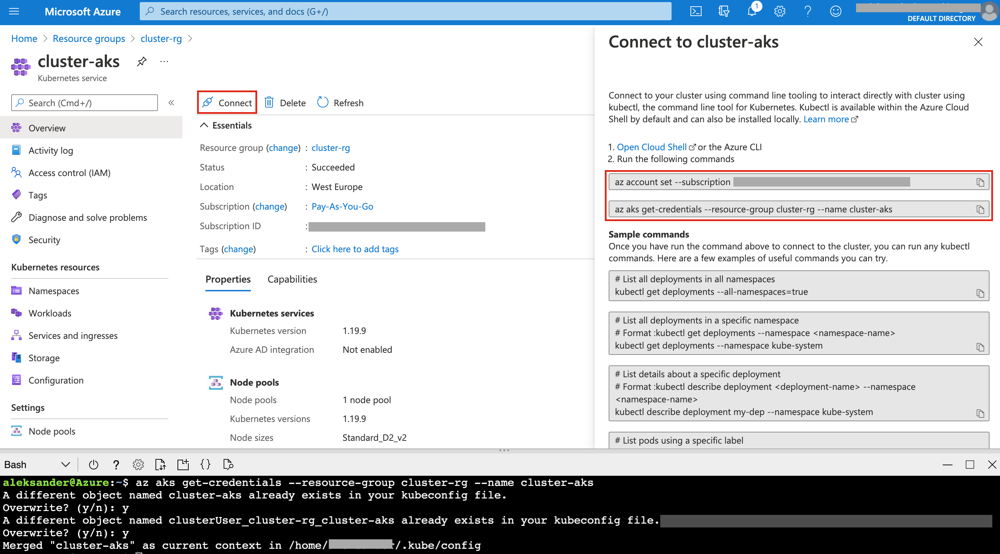

# azure-terraform-aks

## General informations

This project was created as a solution for exercise containing given scenario:

**Create manifests to launch simple static web-site environment on Azure Cloud:**

1. Create Azure Storage Account with private-only access
1. Copy local static web-site files to ASA
1. Create Azure Kubernetes Service Cluster (AKS Cluster) using default Linux image:
    * Every new pod should have installed Apache web server
    * Every pod should copy static website files from ASA to
    its Apache web server root directory (Use aadPodIdentity)
1. Set number of containers (pods) for auto-scaling: min=1, max=10
1. Add Gateway on top of AKS to have one point of entry

---

## Solution

### (root-module)
> Root module glues every other module together and is responsible for other operations (like Role assignments)

### aks-cluster
> Azure Kubernetes Service Cluster module.

### application-gateway
> Application Gateway module.


---
## Launch instruction
---
0. Preparation (if service principal is being created through azure portal):
* Home -> Azure Active Directory -> App registrations -> New registration -> insert name and create
* Certificates & secrets -> New client secret -> Add
* **Application (client) ID** = aks-cluster: client_id
  
  Newly created secret value = aks-cluster: client_secret

  Needed to role assignments service principal object ID =

  ```az ad sp show --id <app_id>```
  
  executed in `AzureCLI`

  (**Object ID** under **Application (client) ID** in **App registrations** bookmark is wrong value)
---
1. in root module
```
    terraform apply
```
2. Open `AzureCLI` on Azure Portal and connect to newly created AKS Cluster



3. In that same `AzureCLI` insert lines below to enable the AGIC add-on on existing AKS Cluster and Application Gateway (after establishing connection with aks cluster)

```
appgwId=$(az network application-gateway show -n cluster-gw -g cluster-rg -o tsv --query "id") 

az aks enable-addons -n cluster-aks -g cluster-rg -a ingress-appgw --appgw-id $appgwId
```

4. Deploy sample application in the AKS Cluster
```
kubectl apply -f https://raw.githubusercontent.com/Azure/application-gateway-kubernetes-ingress/master/docs/examples/aspnetapp.yaml
```


useful links:

* https://docs.microsoft.com/en-us/azure/application-gateway/tutorial-ingress-controller-add-on-existing#enable-the-agic-add-on-in-existing-aks-cluster-through-azure-cli
* https://docs.microsoft.com/en-us/azure/application-gateway/ingress-controller-autoscale-pods
* https://registry.terraform.io/modules/claranet/aks/azurerm/latest/submodules/agic
* https://github.com/Azure/aad-pod-identity
* https://github.com/cloudcommons/terraform-kubernetes-aad-pod-identity-rbac
<!-- ```
helm repo add aad-pod-identity https://raw.githubusercontent.com/Azure/aad-pod-identity/master/charts
helm install aad-pod-identity aad-pod-identity/aad-pod-identity
```

```
helm repo add application-gateway-kubernetes-ingress https://appgwingress.blob.core.windows.net/ingress-azure-helm-package/
helm repo update
```

```
wget https://raw.githubusercontent.com/Azure/application-gateway-kubernetes-ingress/master/docs/examples/sample-helm-config.yaml -O helm-config.yaml

nano helm-config.yaml
```

```
helm install ingress-azure \
  -f helm-config.yaml \
  application-gateway-kubernetes-ingress/ingress-azure \
  --version 1.3.0
``` -->